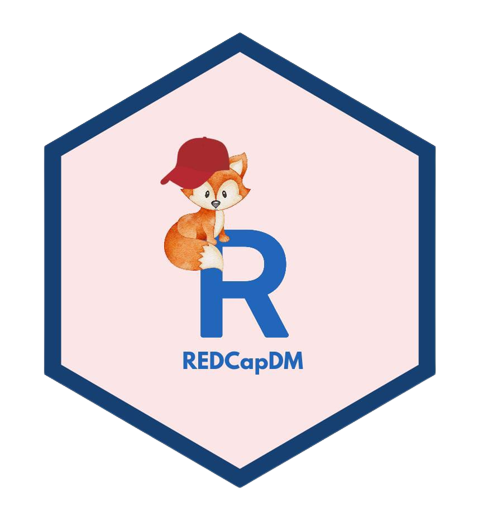

# REDCapDM 
R package to perform data management of REDCap datasets in R

Package: REDCapDM

Type: Package

Title: REDCap Data Management

Version: 0.1.0

Authors: João Carmezim, Judith Peñafiel, Pau Satorra, Esther García, Natàlia Pallarés, Naiara Santos, Cristian Tebé.

Maintainer: João Carmezim, Pau Satorra

Description: Access and manage 'REDCap' data. 'REDCap' (Research Electronic Data CAPture; <https://projectredcap.org>) is a web application for building and managing online surveys and databases developed at Vanderbilt University. The API allows users to access data and project meta data (such as the data dictionary) from the web programmatically. This package allows us to read 'REDCap' data, exported or using an API connection, identify missing or extreme values, identify missing REDCap events in each observation, do a follow-up of the queries initially identified and it also facilitates the process of data management.

Tested in REDCap version 12.4.17.

License: MIT + file LICENSE

Encoding: UTF-8

Depends: R (>= 2.10)
